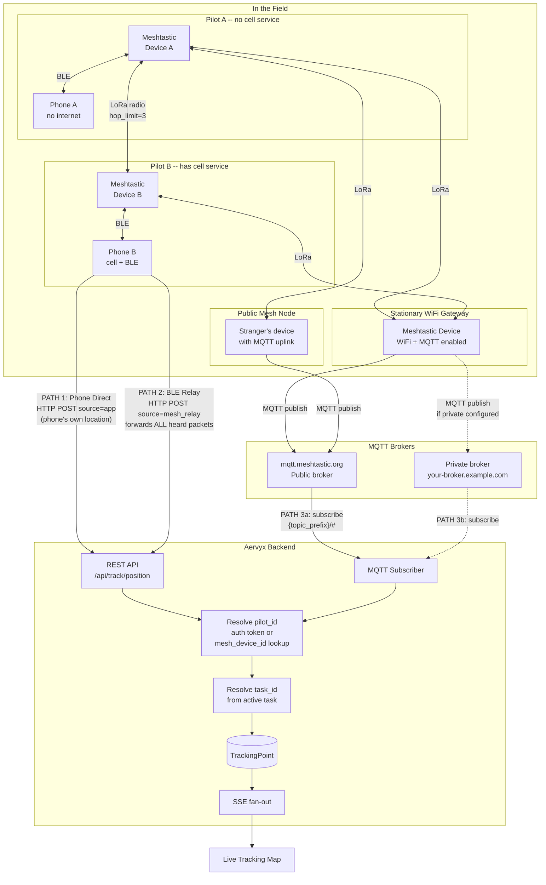
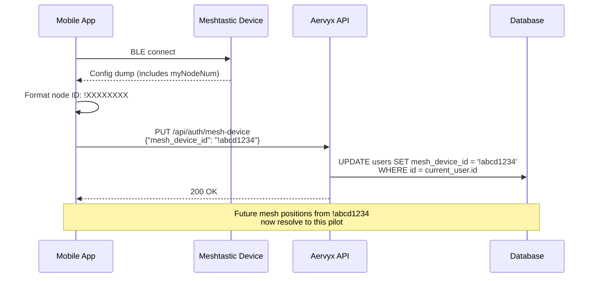

# Meshtastic Position Data Flow

How positions get from devices in the field to the Aervyx live tracking map.

## Overview

There are **3 paths** a position can take from the field to the live map:

| Path | What sends the position | Internet needed on | Latency |
|------|------------------------|-------------------|---------|
| **1 - Phone Direct** | Phone sends its own location over cellular | Pilot's phone | ~1s |
| **2 - BLE Relay** | Phone forwards mesh packets to Aervyx API | Pilot's phone | ~2-5s |
| **3 - MQTT** | Gateway node publishes to MQTT broker | WiFi/Ethernet gateway | ~5-15s |



---

## Path 1 -- Phone Direct (cellular)

The pilot's phone has cell service. The Aervyx mobile app sends the phone's own
location directly to the backend over cellular data. No Meshtastic device is
involved in this path -- it is pure phone-to-server.

| Step | What happens |
|------|-------------|
| Phone location fix | Android/iOS location services provide lat/lon/alt |
| HTTP POST | `POST /api/track/position` with `source=app` |
| Auth | Bearer token identifies the pilot |
| Store + broadcast | Position saved, SSE pushed to live map |

**When it works:** Pilot has cell service. Lowest latency, simplest path.
No mesh radio needed.

---

## Path 2 -- BLE Relay (phone bridges mesh to API)

The phone is paired to a Meshtastic device via Bluetooth Low Energy. The device
receives LoRa packets from the entire mesh network. The phone app reads those
packets, parses the protobuf, and forwards every position to the backend.

| Step | What happens |
|------|-------------|
| LoRa broadcast | Any mesh device broadcasts its position |
| Relay / rebroadcast | Other mesh nodes repeat the packet (up to `hop_limit`) |
| BLE delivery | Phone reads `fromRadio` BLE characteristic |
| Protobuf parse | App extracts MeshPacket -> Position (lat, lon, alt, speed) |
| HTTP POST | `POST /api/track/position` with `source=mesh_relay`, `device_id=!XXXXXXXX` |
| pilot_id lookup | Backend matches device_id to `users.mesh_device_id` |
| task_id lookup | Backend finds pilot's active task from event registration |
| Store + broadcast | Position saved, SSE pushed to live map |

**Key detail:** This path forwards **all** mesh positions heard by the connected
device, not just its own. If Pilot B's phone has cell service and Pilot A is
beyond cell range but within LoRa range, Pilot A's position reaches Aervyx
through Pilot B's phone.

---

## Path 3 -- MQTT (mesh to broker to Aervyx subscriber)

A Meshtastic device with internet access (WiFi or Ethernet) and MQTT enabled
acts as a gateway. It publishes every mesh packet it receives to an MQTT broker.
The Aervyx backend subscribes to that broker.

| Step | What happens |
|------|-------------|
| LoRa broadcast | Device broadcasts position via radio |
| Mesh relay | Other nodes rebroadcast (up to `hop_limit`) |
| Gateway receives | Any MQTT-enabled node with internet hears the packet |
| MQTT publish | Gateway publishes to broker topic `msh/US/2/e/LongFast/!GATEWAYID` |
| Decode/decrypt | Plaintext packets are parsed directly; encrypted packets are decrypted with the configured/default channel PSK when possible |
| Aervyx subscribes | MQTT subscriber receives the ServiceEnvelope message |
| Protobuf parse | ServiceEnvelope -> MeshPacket -> Position |
| pilot_id lookup | `from_node` -> `!XXXXXXXX` -> `users.mesh_device_id` |
| task_id lookup | Active task resolution from event registration |
| Store + broadcast | Position saved, SSE pushed to live map |

**Gateway topic rule:** On the public broker, Aervyx subscribes to registered mesh
device IDs. If an Ethernet/Wi-Fi gateway is publishing packets heard from trackers,
the gateway ID must be registered too; trackers appear inside the MeshPacket `from`
field, not necessarily in the MQTT topic suffix.

**MQTT encryption:** Our profiles set `encryption_enabled=false` on the MQTT config
so that channel packets arrive in plaintext on the broker. If a device publishes an
encrypted MeshPacket anyway, the backend records it as heard and attempts
Meshtastic AES-CTR decryption with the configured/default channel PSK. Wrong or
missing keys still prove the gateway/sender were heard, but no position is stored.

---

## Public vs Private MQTT

### Public broker (mqtt.meshtastic.org)

```
Your devices --> mesh --> ANY node with MQTT uplink --> broker
                          (yours OR a stranger's)
```

- Broader coverage: random hikers, other pilots, and public gateways all relay
  your positions for free
- Zero infrastructure: Meshtastic runs the broker
- Your positions are visible to anyone subscribing to the public broker
- You share bandwidth with all Meshtastic traffic worldwide

### Private broker (self-hosted)

```
Your devices --> mesh --> only YOUR configured nodes --> your broker
```

- Private: only you see the data
- Dedicated bandwidth, no shared noise
- No benefit from public nodes -- strangers cannot relay to your broker because
  they do not have your credentials
- You must run and maintain the broker infrastructure
- Aervyx's Docker stack includes Mosquitto for this path; see
  `docs/private-mqtt-broker.md` for the VM listener and credential setup.

---

## Radio relay vs MQTT uplink

These are two different things:

- **Radio relay** happens at the LoRa level. Every Meshtastic device in range
  rebroadcasts packets it hears, up to `hop_limit`. No internet, no decryption,
  no channel matching needed. A stranger's device on a mountaintop extends your
  mesh range automatically.

- **MQTT uplink** happens at the application level. A device with internet +
  channel uplink enabled forwards channel traffic to an MQTT broker. This is how
  positions reach the Aervyx backend via Path 3.

A stranger's device always helps with radio relay. It only helps with MQTT uplink
if it is on the same channel with uplink enabled and connected to the same broker.

---

## Scenario: Pilot A is out of cell range

```
Pilot A (no cell)          Pilot B (has cell)           Aervyx
                                                        
     |                          |                         |
     | -- LoRa broadcast ---->  |                         |
     |    (position packet)     |                         |
     |                          |                         |
     |                     Phone receives                 |
     |                     packet via BLE                 |
     |                     from Device B                  |
     |                          |                         |
     |                          | -- HTTP POST -------->  |
     |                          |    source=mesh_relay     |
     |                          |    device_id=!A_ID       |
     |                          |                         |
     |                          |                    Resolve:
     |                          |                    !A_ID -> Pilot A
     |                          |                    Pilot A -> active task
     |                          |                         |
     |                          |                    Store + SSE broadcast
     |                          |                         |
     |                          |                    Pilot A appears
     |                          |                       on live map
```

Pilot A never had internet, but their position reached the map through the mesh
network and Pilot B's phone acting as a relay.

---

## Device ID auto-registration

When a pilot connects to a Meshtastic device via BLE in the mobile app, the app
automatically registers that device's node ID (`!XXXXXXXX`) against the pilot's
account. No manual configuration is needed.

If the pilot switches to a different device, the new device ID overwrites the
old one. This means the MQTT subscriber and BLE relay can always resolve
incoming mesh positions to the correct pilot.

Infrastructure devices (Repeater profile) are a special case: when a user applies
the Repeater profile, the app unregisters the device from their account. This
prevents a stationary relay node from being tracked as a pilot. When the same
phone later connects to a personal tracker, the new device is auto-registered
normally.



---

## Live tracking works for everyone

Positions are stored and broadcast regardless of whether the pilot is in an
active competition task. The live tracking map has three viewing modes:

| Mode | What it shows | SSE endpoint |
|------|---------------|--------------|
| **Task** | Pilots in a specific competition task | `/api/track/live/{taskId}` |
| **Buddy group** | Selected pilot IDs | `/api/track/live/pilots?ids=...` |
| **All users** | Every active position (public) | `/api/public/live/all` |

A pilot flying free (no active task) still appears in "All users" and buddy
group views. The task_id is optional -- it enables the task-scoped competition
view but is not required for tracking to work.

---

## Requirements for each path

| Requirement | Path 1 (Phone Direct) | Path 2 (BLE Relay) | Path 3 (MQTT) |
|-------------|:---:|:---:|:---:|
| Meshtastic device needed | No | Yes (paired via BLE) | Yes (any node with MQTT) |
| Phone has cell service | Yes | Yes | No |
| MQTT gateway node exists | No | No | Yes |
| Device auto-registered to user | No | Yes (auto on connect) | Yes (auto on connect) |
| Pilot registered for active task | No | No | No |
| What provides internet | Phone cellular | Phone cellular | Gateway WiFi/Ethernet |
